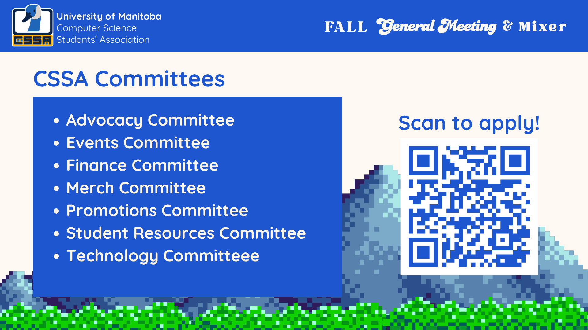

# Committees

For committees this year, we have seven committees:

- Advocacy
  - Working to make sure that CS students feel represented, welcomed, and advocated for.
- Events
  - Working to help create, plan, and run events.
- Finance
  - Working to connect with sponsors, and fund our initiatives.
- Merch
  - Working to create new products for events and general merchandise sales.
- Promotions
  - Working to help better promote our events and initiatives
- Student Resources
  - Working to create resources for the CS community
- Technology
  - Working to maintain our tech projects like the website and bot.

Councillor applications are still open until **Wednesday Oct 15th at 11:59pm** and all committees have been re-opened, so this is one last chance to get involved for the fall semester. Visit [umanitobacssa.ca/councillors](https://umanitobacssa.ca/councillors) to apply!
