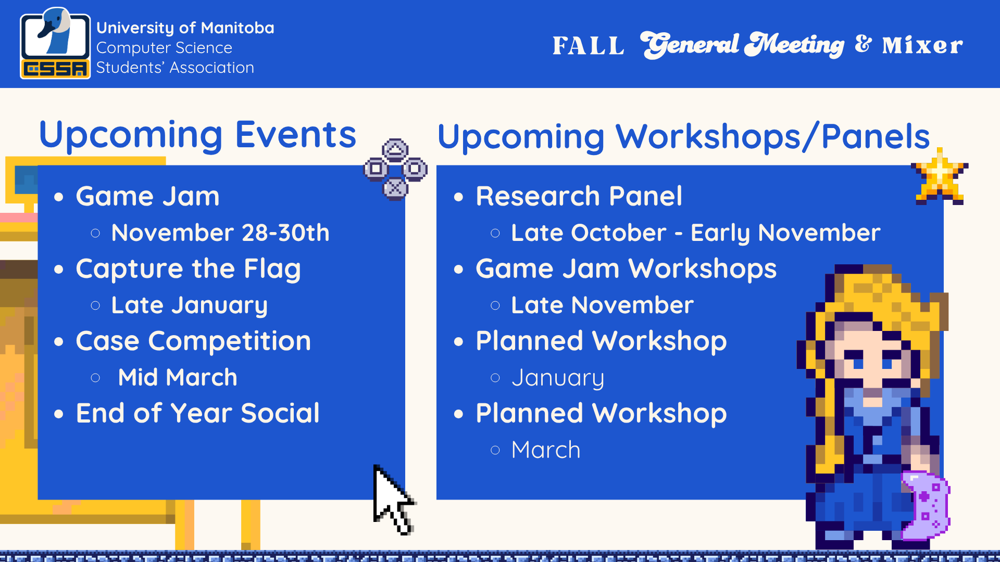

## Events and Workshops:

### Events

- Game Jam
    - November 28-30th
  - Come on out for our ~40 hour Game Jam. This is an opportunity to create a game with a team, and then present it to try and win one of the categories.
- Capture the Flag
  - Late January/Early Feb
  - Put your knowledge of cyber-security to the test, and try to solve problems to retrieve the flags, and gain points!
- Case Competition
  - Mid March
  - Join us with Asper Commerce Student Association, where you will be put into teams of business and CS students to try and solve a problem, and create a solution
- End of Year event (Tentative)
  - April
  - TBD what this event will contain

### Workshops/Panels
- Research Panel
  - Early November
  - Connect with some research lab people and learn more about what you could do for a URA or a USRA
- Game Jam Workshops
  - Late November
- Planned Workshop
  - January
- Planned Workshop
  - March
