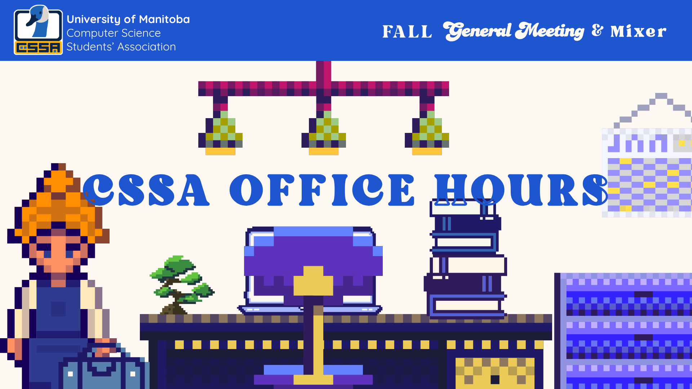
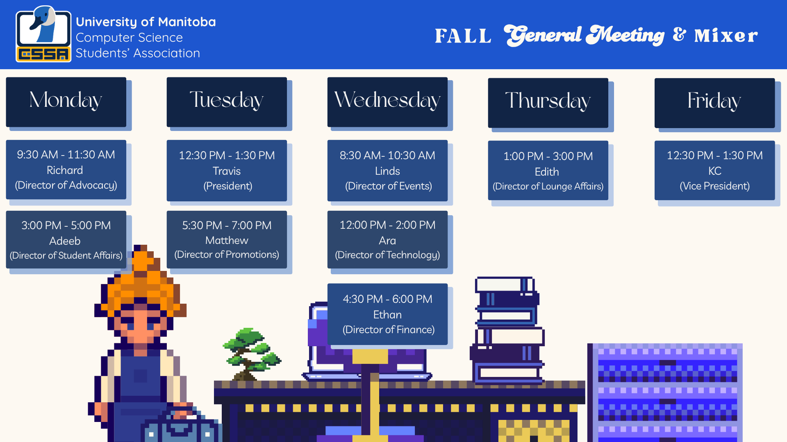

## Lounge:

Just a reminder that we have a space at **EITC E1 - 586**. This space is open to the public when there are lounge supervisors present, and has opportunities to connect with fellow students, grab some snacks, and study/work.

### CSSA Office Hours

Office hours are an opportunity where executives are available at the lounge for you to chat with. Want to learn more about a certain part of the CSSA or have concerns that you want our help with? Come visit us during office hours!

### CSSA Office Hours Schedule

