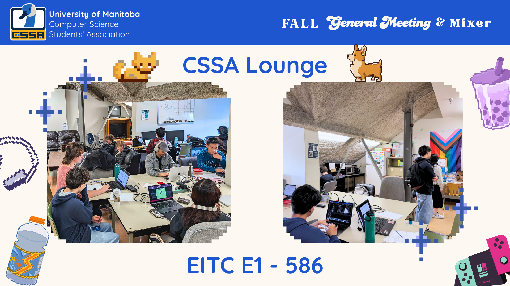
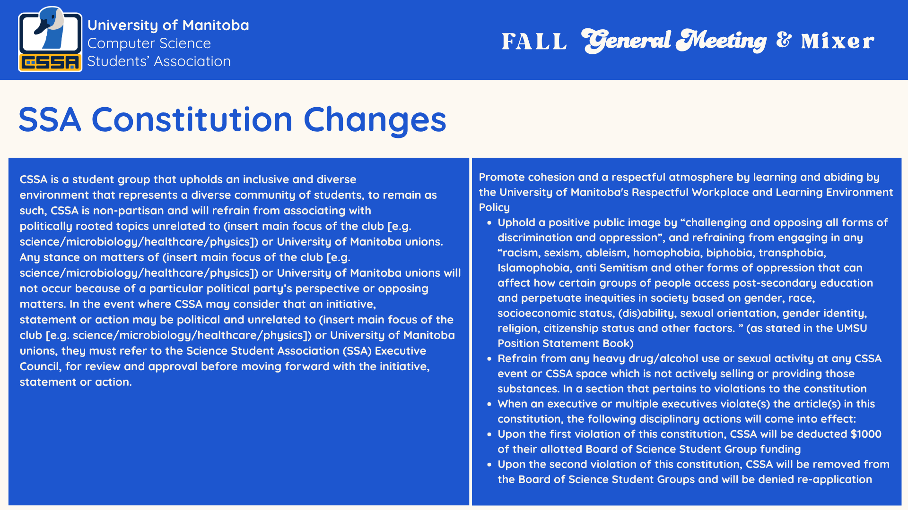

The agenda was as follows:

- Introductions
- Committee Introductions
- Upcoming events/workshops/panels
- CSSA Lounge
- CSSA Office Hours
- Merch
- SSA Constitution Terms

## Committees 

For committees this year we have seven committees:

- Advocacy
  - Working to make sure that CS students feel represented, welcome, and advocated for.
- Events
  - Working to help create, plan, and run events.
- Finance
  - Working to connect with sponsors, and fund our initiatives.
- Merch
  - Working to create new products for events and general merchandise sales.
- Promotions
  - Working to help better promote our events and initiatives
- Student Resources
  - Working to create resources for the CS community
- Technology
  - Working to maintain our tech projects like the website and bot.

Councillor applications are still open until **Wednesday Oct 15th at 11:59pm** and all committees have been re-opened, so this is one last chance to get involved for the fall semester. Visit [umanitobacssa.ca/councillors](https://umanitobacssa.ca/councillors) to apply!

## Events and Workshops:

### Events

- Game Jam
    - November 28-30th
  - Come on out for our ~40 hour Game Jam. This is an opportunity to create a game with a team, and then present it to try and win one of the categories.
- Capture the Flag
  - Late January/Early Feb
  - Put your knowledge of cyber-security to the test, and try to solve problems to retrieve the flags, and gain points!
- Case Competition
  - Mid March
  - Join us with Asper Commerce Student Association, where you will be put into teams of business and CS students to try and solve a problem, and create a solution
- End of Year event (Tentative)
  - April
  - TBD what this event will contain

### Workshops/Panels
- Research Panel
  - Early November
  - Connect with some research lab people and learn more about what you could do for a URA or a USRA
- Game Jam Workshops
  - Late November
- Planned Workshop
  - January
- Planned Workshop
  - March

## Lounge:

Just a reminder that we have a space at **EITC E1 - 586**. This space is open to the public when there are lounge supervisors present, and has opportunities to connect with fellow students, grab some snacks, and study/work.

### CSSA Office Hours

Office hours are an opportunity where executives are available at the lounge for you to chat with. Want to learn more about a certain part of the CSSA or have concerns that you want our help with? Come visit us during office hours!

### CSSA Office Hours Schedule

## Merch:

We are happy to start the year off with offering the CSSA Hoodie, we have S, M, L, and XL and it is $48. For purchase, come visit us during office hours, or send us an email(cssa@umanitoba.ca) to arrange a time for payment/pickup.

## SSA Constitution Changes:

The SSA is trying to bring changes for us to get the funding that is provided to them, to distribute to science clubs with a few terms that would ultimately restrict what we can say and do within our constitution. We would prefer to not add these changes to our constitution as some of them are quite vague, or don't have good definitions, or should be left to voting whether that be a general meeting/council decision/election decision. We want to allow the CSSA to be flexible and adapt, and also want to be looking out to the future with our constitution. There are also some penalties if we do not follow these terms, which would take funding away from us.
